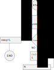

# KIV/BIT task 03 - Feistel encryption algorithm

## Compilation

The compilation process is done through the `make`command that's supposed to be executed in the root folder of the project structure. Once the process has completed, a file called `feistel` will be generated. This file represents the executable file of the application.

## Execution

### help
```
> ./feistel --help
KIV/BIT task 3 - feistel encryption/decryption
Usage:
  ./feistel <input> <keys> [OPTION...]

  -b, --binary      the input file is a binary file
  -v, --verbose     print out info as the program proceeds
  -o, --output arg  name of the output file (default: output.txt)
  -p, --print       print out the binary data as well as the decrypted text
  -h, --help        print help
>
```
### input
The program takes two required parameters - the input file and the key file. The content of the input file will go through the process of encryption as well as decryption within one run of the program. The second compulsory parameter, the key file, is a file containing keys to be used within the algorithm.

#### input file
There's no requirement as to what the structure of the input file should be. It could be any file, including binary files, such as images, documents, etc. If the input file happens to be a binary file, the user will need to specify it using the `-b` option so the program can treat it accordingly. By default, the program assumes the input file is a text file.
```
./feistel dwarf_small.bmp keys.txt -b
```
#### key file
The number of keys is not limited. However, the file containing the keys needs to have the following structure.
```
k0=0101
k1=0111
k2=0000
```
Each line represents a key to be used in one iteration through the Feistel network. Therefore, the number of keys determines the number of iterations to be carried out in total. Since 8 bits are considered to be one block of data, the key itself must be a number (in a binary format) less than 16.
```
 LEFT      RIGHT
-----------------
7 6 5 4 | 3 2 1 0
0 1 0 0 | 1 1 0 1 = 8 bits in total (one block of data)
-----------------
8 / 2 = 4
2^4 = 16
```
If the file doesn't have this structure, an error will be printed out on the screen.

### output
After the program has been run, a file called `output.txt` will be created containing the required output. The file is consists of three lines in total with the following meanings.
```
8C 71 E8 E8 DB 20 72 DB 07 E8 60 31 # encrypted data in HEX
48 65 6C 6C 6F 20 57 6F 72 6C 64 21 # decrypted data in HEX
Hello World!			    # decrypted data in ASCII (if it's a text file)
```
However, the last line differs by the type of input file. If a text file has been used, the third line will hold the encrypted ASCII text, which should match the original file.
In the case of a binary file, the third line displays a note referring to another binary file, which has been generated after decryption. This file has a prefix of  `feistel_`, and the rest matches the name of the input file.
```
INFO: The decrypted content of the file can be found in 'feistel_dwarf_small.bmp'
```
### Examples execution
```
./feistel input.txt keys.txt
./feistel dwarf_small.bmp keys.txt -b
./feistel input.txt keys.txt -v
./feistel input.txt keys.txt -v -p -o out.txt
```
## Feistel encryption algorithm
### encryption
The algorithm encrypts each block of data individually. In this case, the block has a size of 8 bits (1 byte). As the first step, the block of data needs to be divided into the left-hand side and right-hand side as shown below.
```
block = 0x56
LHS = 0x05 (0101)
RHS = 0x06 (0110)
```
Once this is done, we apply the following algorithm in order to encrypt this block of data.



#### The F function
This function was given beforehand as `f(Ri-1, Ki) = (Ri-1 xor Ki) and ¬Ki`.

### decryption
As far as the decryption process is concerned, all we need to do is to use the same algorithm with the keys in the reversed order. So instead of using `key[i]`, we will use `key[n-i-1]`, where `n` is the total number of keys.
